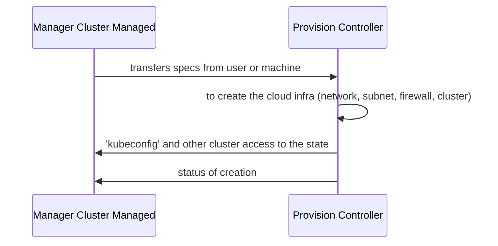
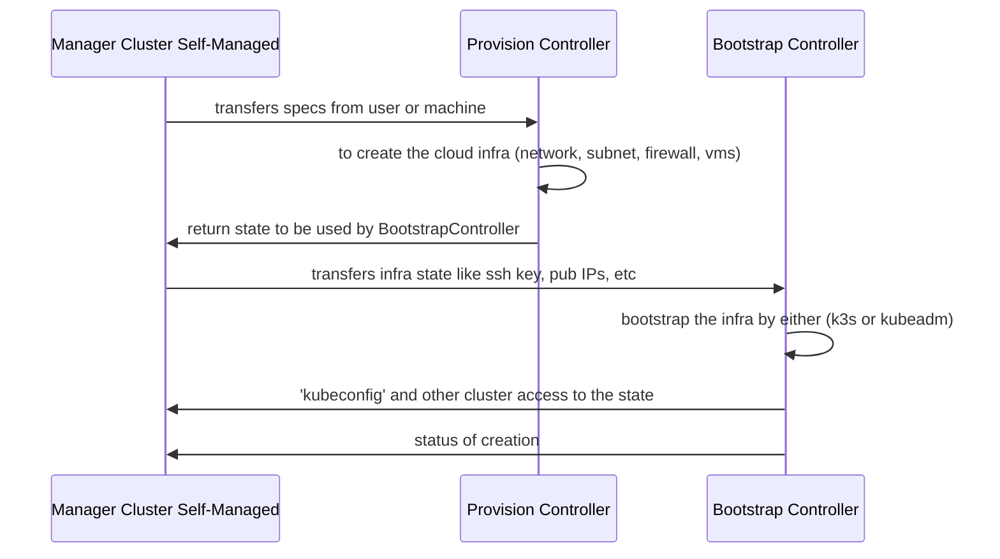

{}
This section will help you to learn about the underlying system of Ksctl. It will help you to obtain a deeper understanding of how Ksctl works.
{}

## 📐 Architecture
Here is the entire Ksctl system level design

## Sequence diagrams for 2 major operations

### Create Cloud-Managed Clusters

### Create Self-Managed HA clusters

