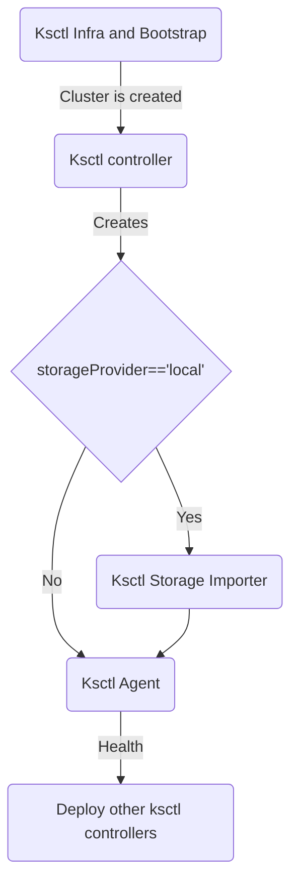

## Components
- ksctl agent
- ksctl stateimporter
- ksctl application controller

## Sequence diagram on how its deployed

```mermaid
flowchart TD
Base(Ksctl Infra and Bootstrap) -->|Cluster is created| KC(Ksctl controller)
KC -->|Creates| Storage{storageProvider=='local'}
Storage -->|Yes| KSI(Ksctl Storage Importer)
Storage -->|No| KA(Ksctl Agent)
KSI -->KA
KA -->|Health| D(Deploy other ksctl controllers)
```
