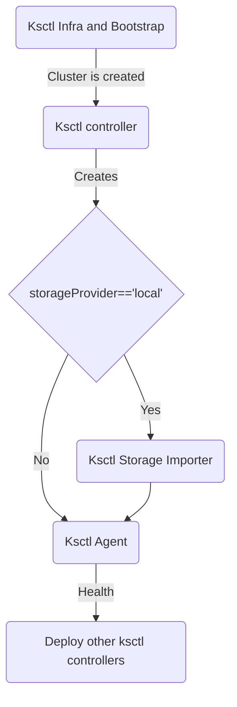

## Components
- ksctl agent
- ksctl stateimporter
- ksctl application controller

## Sequence diagram on how its deployed

{}
Here is the new event driven architecture Diagram

For more information about this
[Refer](https://github.com/ksctl/enhancements/tree/main/poc/ksctl-components)

{}
