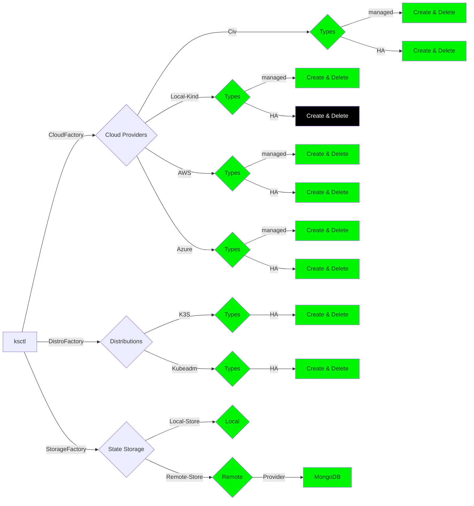

{}
Current Status on Supported Providers and Next Features
{}

### Supported Providers

Done

Not Started

No Plans

Backlog

### Next Features

- Talos as the next Bootstrap provider
- Green software which can help you save energy and also better somehow
- WASM first class support feature
- ML features unikernels and better ML workload scalability
- Production stack for monitoring, security, to application specific application integrations like vault, kafka, etc.
- Health checks of various k8s cluster
- Role Based Access Control for any cluster
- Ability import any existing cluster and also to respect the existing state and not overwrite it with the new state from ksctl but to be able to manage only the resources which the tool has access
- add initial production ready for cert manager + ingress controller (nginx) + gateway api
- add initial production ready for monitoring (prometheus + grafana) tracing (jaeger) Opentelemtery support
- add initial production ready for Networking (cilium)
- add initial production ready for service mesh (istio)

