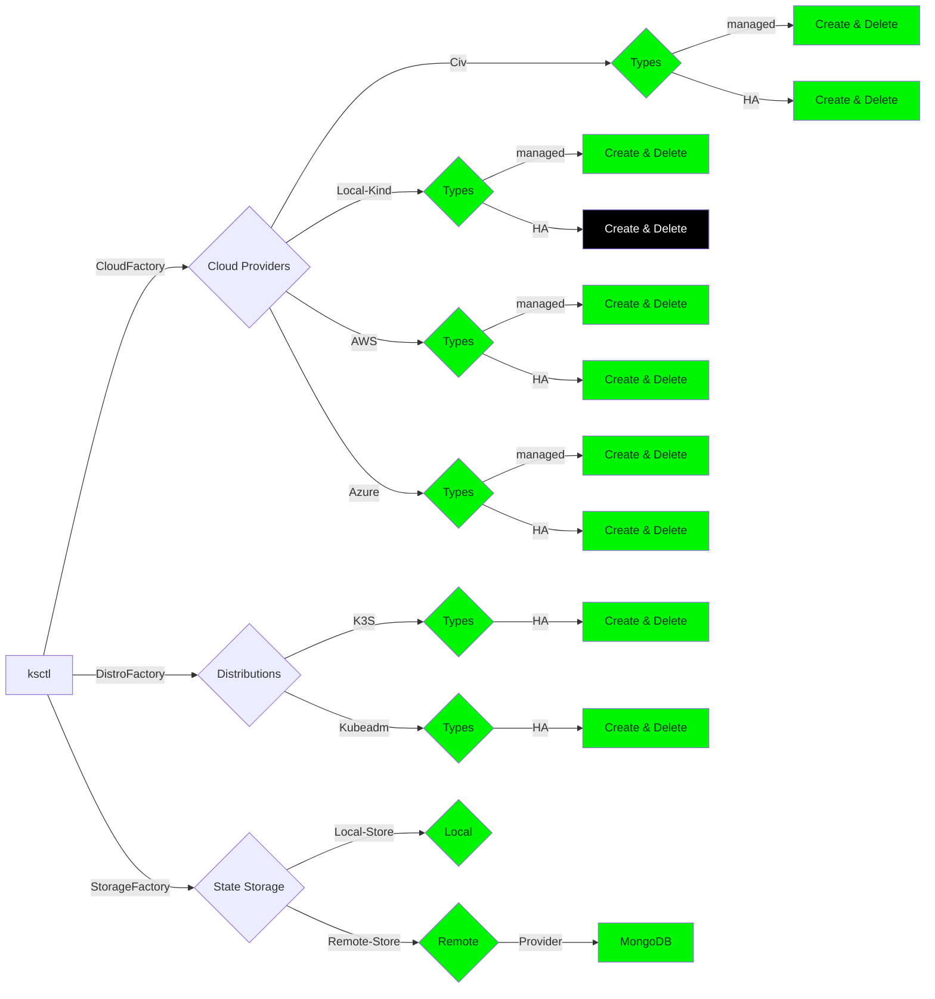

{}
Current Status on Supported Providers
{}

Done

Not Started

No Plans

Backlog

```mermaid
flowchart LR;
  classDef green color:#022e1f,fill:#00f500;
  classDef red color:#022e1f,fill:#f11111;
  classDef white color:#022e1f,fill:#fff;
  classDef black color:#fff,fill:#000;
  classDef blue color:#fff,fill:#00f;

  XX[ksctl]--CloudFactory-->web{Cloud Providers};
  XX[ksctl]--DistroFactory-->web2{Distributions};
  XX[ksctl]--StorageFactory-->web3{State Storage};

  web--Civo-->civo{Types};
  civo:::green--managed-->civom[Create & Delete]:::green;
  civo--HA-->civoha[Create & Delete]:::green;

  web--Local-Kind-->local{Types};
  local:::green--managed-->localm[Create & Delete]:::green;
  local--HA-->localha[Create & Delete]:::black;

  web--AWS-->aws{Types};
  aws:::green--managed-->awsm[Create & Delete]:::green;
  aws--HA-->awsha[Create & Delete]:::green;

  web--Azure-->az{Types};
  az:::green--managed-->azsm[Create & Delete]:::green;
  az--HA-->azha[Create & Delete]:::green;

  web2--K3S-->k3s{Types};
  k3s:::green--HA-->k3ha[Create & Delete]:::green;

  web2--Kubeadm-->kubeadm{Types};
  kubeadm:::green--HA-->kubeadmha[Create & Delete]:::green;

  web3--Local-Store-->slocal{Local}:::green;
  web3--Remote-Store-->rlocal{Remote}:::green;
  rlocal--Provider-->mongo[MongoDB]:::green;

```

