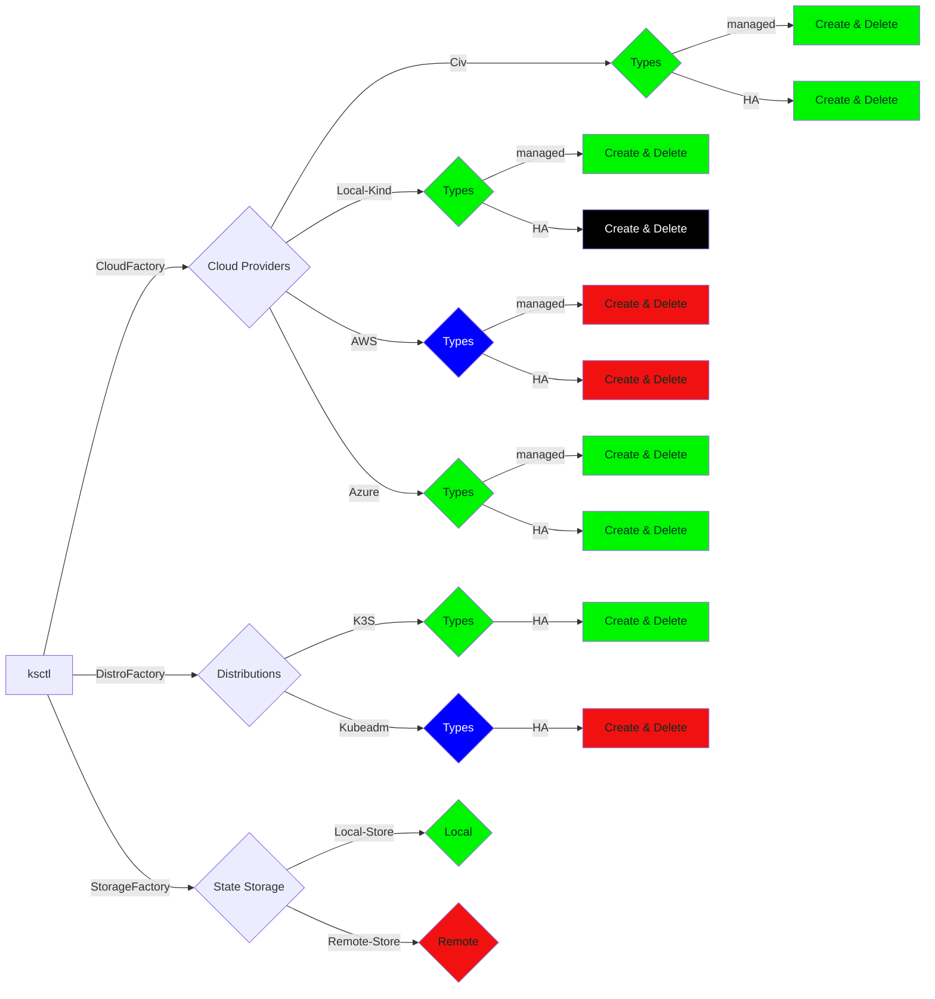

## Current Status on Supported Providers

Done

Not Started

No Plans

Backlog

## Future Plans

1. add distributions of binaries via the package managers
2. AWS Support
3. GCP support
4. improve context switch
5. Cloud Controller support for more control
6. Create RestAPI for using ksctl without CLI
7. Create server running ksctl which can reconsile state automatically
8. A single source of truth for Both CLI and ksctl server
9. Dashboard for Ksctl
10. Kubeadm support
11. Data store - etcd (follow-up cluster of datastores)
12. Production Ready Apps
13. ~~Development Ready Apps~~
14. ~~additional kubernetes application support~~
15. ~~improve the High avilability cluster architecture~~
16. ~~improve logging in local~~

